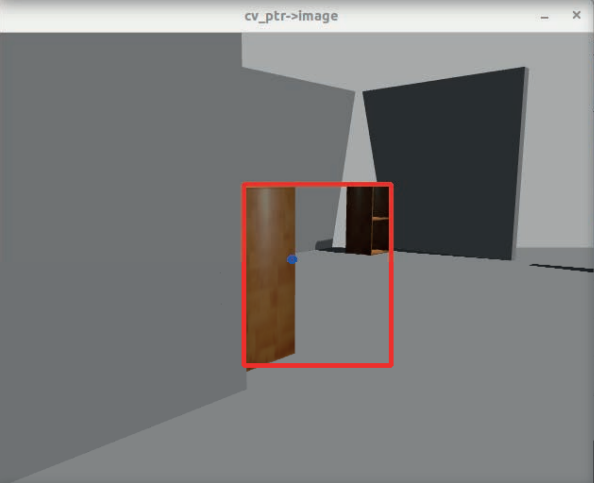

  <h1 align="center">OBJECT TRACKER FOR A DIFFERENTIAL DRIVE ROBOT USING ROS2 OPENCV AND PIDCONTROLLER</h1>

Made to be used with this [Project](https://github.com/Nil69420/Differential-Drive-Robot-Path-Planning-Using-ROS2-Nav2-Gazebo)

  

* Tested using Tiago robot.

  

